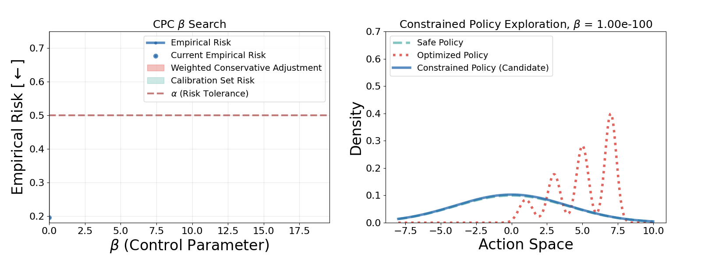

# Conformal Policy Control

Code for ["Conformal Policy Control"](https://arxiv.org/abs/2603.02196) (ICML 2026 spotlight paper): a framework for enabling AI agents to automatically determine their own "zone of competence," where we can place guarantees on their behavior respecting a user's risk tolerance, $\alpha$.

By Drew Prinster, Clara Fannjiang, Ji Won Park, Kyunghyun Cho, Anqi Liu, Suchi Saria, and Samuel Stanton.

### Citation

If you use this code, please our paper:
```bibtex
@inproceedings{prinster2026conformal,
  title={Conformal Policy Control},
  author={Prinster, Drew and Fannjiang, Clara and Park, Ji Won and Cho, Kyunghyun and Liu, Anqi and Saria, Suchi and Stanton, Samuel Don},
  booktitle={Forty-third International Conference on Machine Learning},
  year={2026}
}
```

## Overview

This project develops **Conformal Policy Control (CPC)**: a method for iteratively improving a language model policy while maintaining formal guarantees on the risk (e.g., rate of infeasible or unsafe outputs) over time. The key idea is to constrain each optimized policy's likelihood ratios relative to a safe reference policy, with the constraint level calibrated via CPC so that risk stays below a user-specified level, $\alpha$.



The repository contains four sets of experiments:

- **`cpc_llm/`** : **The main CPC pipeline for LLMs**, applied to the Ehrlich function synthetic protein discovery task ([Chen, et al. 2025](https://arxiv.org/abs/2410.22296)). Pre-trains a language model on data from a genetic algorithm, then iteratively generates and scores new samples, trains optimized policies (SFT, DPO, or MARGE), and uses CPC to ensure the improved policies satisfy safety constraints.
- **`cbo/`** : Constrained Bayesian optimization experiments (in paper appendix). Compares CPC to classic conservative optimization. **This is a more accessible initial entrypoint to CPC code (runs on a single CPU).**
- **`constrained_AL/`** : CPC constrained active learning with Gaussian process surrogates, applied to tabular regression benchmarks. 
- **`QA_expts/`** : Generalized conformal risk control (gCRC) for LLM factuality, controlling false discovery rate (a non-monotonic loss) on medical QA dataset of GPT-3.5-Turbo responses.

## Setup

Requires Python >= 3.10 and [uv](https://docs.astral.sh/uv/).

To install all dependencies (including the `cpc-llm` package in editable mode) and dev tools (pytest), and then activate the environment, run

```bash
uv sync --group dev

source .venv/bin/activate
```

## Running the CPC-LLM pipeline

The pipeline is configured via [Hydra](https://hydra.cc/). Configs live in `cpc_llm/config/`.

```bash
# Smoke test (~5 min, tiny model)
cpc-llm --config-name=smoke local_output_dir=/path/to/local_output parent_output_dir=/path/to/parent_output

# Full single run with S3 storage (CPC alpha=0.6):
cpc-llm --config-name=cpc_llm \
  conformal_policy_control.alpha=0.6 initial_seed=0 last_seed=0 \
  local_output_dir=/path/to/local \
  parent_output_dir=s3://bucket/path

# With slurm (and changing resource params in run_cpc_llm.sh), run many parallel GPU jobs to reproduce paper's Fig 6 via
bash submit_cpc_llm_expts.sh "0.4,0.6,0.8,1.0" 0 29
```


### Key config parameters

| Parameter | Description |
|-----------|-------------|
| `conformal_policy_control.alpha` | Risk level (e.g., 0.4 for 40% constraint violation rate) |
| `num_sft_rounds` / `num_dpo_rounds` / `num_marge_rounds` | Number of training iterations per method |
| `initial_seed` / `last_seed` | Initial / last random seeds (inclusive) to run in loop for repeat trials |
| `parent_output_dir` | S3 path for outputs (set to `null` for local-only) |
| `local_output_dir` | Local path for outputs and model checkpoints |

### Important notes

- **Storage**: The pipeline supports both local and S3 storage. Model checkpoints are copied to S3 and deleted locally after training. Set `parent_output_dir: "null"` to disable S3.
- **SLURM**: Training, generation, and scoring jobs are launched as their own SLURM jobs. Configure via `slurm_args` sections in the config.
- **Resuming**: The pipeline automatically resumes prior runs if launched with the same config. Use `--overwrite=True` to start fresh.
- **GPU requirements**: Training uses DDP (single-node multi-GPU). You need ~4x the model size in GPU RAM for full-precision training.

## Running tests

```bash
uv run pytest tests/ -v
```

42 unit tests covering the core computational functions. Runs in <5s with no GPU required.

## Project structure

```
cpc_llm/                  # Main CPC-LLM package (installable)
  config/                 # Hydra configs for pipeline variants
  src/cpc_llm/
    main.py               # Entry point
    calibrate/            # CPC algorithm (beta search, likelihood constraining)
    core/                 # Model inference, likelihood computation
    data/                 # Dataset generation, formatting, splitting
    infer/                # Sequence generation, acceptance-rejection sampling
    infrastructure/       # File handling (local/S3), orchestration, SLURM
    train/                # SFT, DPO, MARGE training
    test_functions/       # Ehrlich benchmark utilities
cbo/                      # Constrained Bayesian optimization experiments
constrained_AL/           # Active learning experiments
QA_expts/                 # Medical QA experiments
notebooks/                # Visualization notebooks
tests/                    # Unit tests
```

## License

See [LICENSE](LICENSE).

## Known implementation notes

- **DPO scoring for infeasible prompt sequences**: `DPOTrainerWithLogging` does not count a prompt→response transition from infeasible to feasible as a score improvement, which makes DPO training more permissive of infeasible outputs than originally intended. This does not invalidate the paper's experiments (its main effect is increasing the risk of the unconstrained policy), so it is kept as-is for reproducibility. See the full explanation in [`pref_tuning_trainer.py`](cpc_llm/src/cpc_llm/train/pref_tuning_trainer.py#L123-L141).
